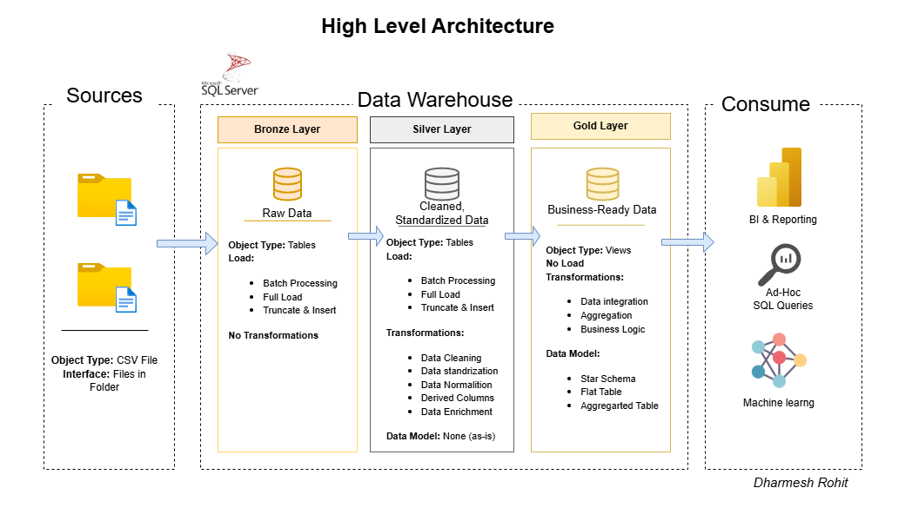

## Candy Distributor Sales Analysis
This project analyzes sales and shipment data for a US national candy distributor, covering customer orders, product details, factory locations, and regional targets. Using Power BI and a structured data warehouse, we explore sales trends, product performance, and geospatial patterns from factory to customer delivery. The goal is to uncover actionable insights that help optimize product strategy, enhance regional performance, and support data-driven business decisions.

**Dataset:** [Maven Analytics](https://mavenanalytics.io/data-playground?order=date_added%2Cdesc)

### Insights and recommendations are provided on the following key areas:

- **Sales Trends:** Analysis of revenue and units sold over time across divisions.

- **Target Achievement:** Comparison of sales against targets by division.

- **Product Performance:** Evaluation of top-selling and high-margin products.

- **Factory Output:** Insight into sales contribution by factory.

- **Geospatial Analysis:** Sales distribution by state and ZIP to identify regional opportunities.

An interactive PowerBI dashboard can be downloaded [here.](https://github.com/dharmeshrohit/Candy-Distributor/blob/main/analysis/doc/Candy%20Distributor%20dashboard.pbix)

The SQL queries utilized to buil data warehouse can be found [here.](https://github.com/dharmeshrohit/Candy-Distributor/tree/main/warehouse/scripts)

The SQL queries utilized to clean, organize, and prepare data for the dashboard can be found [here.](https://github.com/dharmeshrohit/Candy-Distributor/blob/main/warehouse/scripts/gold/ddl_gold.sql)

A comprehensive Analysis Report can be found [here.](https://github.com/dharmeshrohit/Candy-Distributor/blob/main/analysis/doc/Candy%20Distribution%20Analysis%20Report.pdf)

## Data Warehouse
The data warehouse was built using a multi-layered approach:

- **Bronze Layer:** Raw ingested files (factories, products, sales, targets, uszips)

- **Silver Layer:** Cleaned and transformed tables for intermediate use

- **Gold Layer:** Analytical views structured as a dimensional model (facts & dimensions)

Data Warehouse docs can be found [here.](https://github.com/dharmeshrohit/Candy-Distributor/tree/main/warehouse/docs)

## Data Structure and Initial Check
The Candy Distributor’s data model consists of 3 primary tables: `gold.dim_products`, `gold.dim_location` and `gold.fact_sales`. totaling over 100,000 records. These tables capture detailed information on customer orders, product attributes, factory locations, regional sales targets, and ZIP-level geospatial data.

.png)

## Executive Summary
### Overview of Findings
The Candy Distributor has seen a strong upward trend in sales over the past four years, with revenue growing from $29K in 2021 to $47K in 2024, totaling $142K in overall sales. The company sold 39K units during this period, achieving a gross profit of $93.44K and an average price of $3.65.

The chocolate division leads overwhelmingly, contributing over 92% of total sales. Lot’s O’ Chocolate Factory and Wicked Chocolate Works dominate factory-level performance with $76K and $55K in sales, respectively. Monthly sales peaked in October, November, and December, indicating strong seasonal demand.

Below is the Sales analysis page from the PowerBI dashboard and more examples are included throughout the report. The
entire interactive dashboard can be downloaded [here.](https://github.com/dharmeshrohit/Candy-Distributor/blob/main/analysis/doc/Candy%20Distributor%20dashboard.pbix)

## Recommendations
- **Boost High Seasons:** Focus marketing efforts on peak months (Oct–Dec) where sales are strongest.

- **Prioritize Bestsellers:** Products like Wonka Bar variants drive the most revenue—promote them heavily.

- **Trim Low Performers:** Evaluate underperforming products like Kazookles and Wonka Gum for discontinuation.

- **Support Top Factories:** Lot’s O’ Nuts and Wicked Choccy’s contribute the most—ensure smooth operations.

- **Revive Weak Divisions:** Chocolate dominates; explore strategies to uplift Sugar and Other categories.

- **Geo-Target Sales:** Double down in top-performing states (CA, NY, TX); explore new markets in low-sales areas.

- **Enhance Retention:** Customer base is growing—launch loyalty programs to retain and upsell.